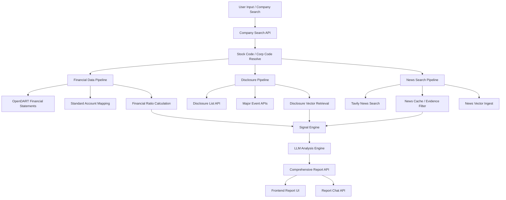
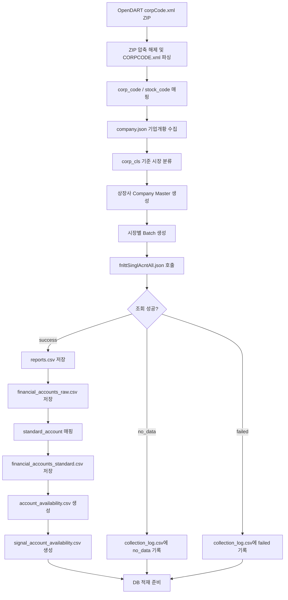
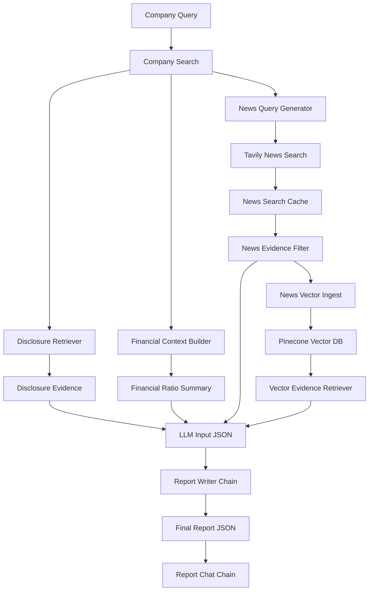

# FINANCE_DOT_ZIP

> OpenDART 기반 기업 재무 분석 및 AI 리포트 생성 시스템

상장기업의 재무제표, 공시, 뉴스 데이터를 수집하고 재무지표와 시그널을 분석하여 AI 기반 종합 리포트와 챗봇 응답을 생성하는 금융 분석 플랫폼입니다.


---

## 목차

1. [프로젝트 개요](#1-프로젝트-개요)
2. [팀 소개](#2-팀-소개)
3. [기술 스택](#3-기술-스택)
4. [시스템 아키텍처](#4-시스템-아키텍처)
5. [데이터 흐름](#5-데이터-흐름)
6. [주요 기능](#6-주요-기능)
7. [AI 분석 및 Vector RAG 구조](#7-ai-분석-및-vector-rag-구조)
8. [데이터 설계](#8-데이터-설계)
9. [설계 선택 이유](#9-설계-선택-이유)
10. [프로젝트 구조](#10-프로젝트-구조)
11. [실행 방법](#11-실행-방법)
12. [서비스 시나리오](#12-서비스-시나리오)
13. [한계 및 향후 개선 방향](#13-한계-및-향후-개선-방향)
14. [동료 회고](#14-동료-회고)

---

## 1. 프로젝트 개요

### 서비스 배경

기업 분석을 위해서는 재무제표, 공시, 뉴스, 산업 정보 등 여러 출처의 데이터를 함께 확인해야 합니다. OpenDART는 공시와 재무제표 데이터를 제공하지만, 원본 계정명이 기업마다 다르고 일부 계정은 누락될 수 있어 바로 분석에 사용하기 어렵습니다.

본 프로젝트는 OpenDART 기반 데이터 수집 파이프라인과 AI 분석 엔진을 결합하여 기업 종합 리포트를 자동 생성하는 것을 목표로 합니다.

### 핵심 목표

- OpenDART API 기반 상장기업 정보 및 재무제표 수집
- KOSPI, KOSDAQ, KONEX 시장별 batch 수집 구조 구성
- 전체 재무제표 API 기반 raw 계정 수집 및 표준계정 전처리
- 재무비율, Warning Signal, Positive Signal 계산 기반 마련
- 공시, 사업보고서, 뉴스 기반 Vector RAG 검색 구조 구현
- 기업 검색 API, 종합 리포트 API, AI 리포트 API, 리포트 챗봇 API 제공
- LLM을 활용한 재무 분석 결과 요약 및 근거 기반 리포트 생성

### 기대 효과

- 기업 재무제표 수집 및 전처리 자동화
- 기업별 재무상태와 위험 신호를 빠르게 확인
- 공시, 뉴스, 재무지표를 함께 반영한 종합 분석 가능
- 기업 리서치, 취업·면접 준비, 팀 프로젝트 분석 자료 생성 시간 단축
- 투자 추천이 아닌, 공시·뉴스·재무지표 기반 기업 분석 보조 정보 제공

---

## 2. 팀 소개

**Team Finance Dot ZIP**  
기업의 숫자와 공시를 압축해서 읽기 쉬운 리포트로 풀어내는 금융 분석 팀입니다.

<table align="center">
  <tr>
    <td align="center" width="150" height="140">
      
    </td>
    <td align="center" width="150" height="140">
      
    </td>
    <td align="center" width="150" height="140">
      
    </td>
    <td align="center" width="150" height="140">
      
    </td>
    <td align="center" width="150" height="140">
      
    </td>
    <td align="center" width="150" height="140">
      
    </td>
  </tr>

  <tr>
    <td align="center"><b>김이선</b></td>
    <td align="center"><b>김지윤</b></td>
    <td align="center"><b>박소윤</b></td>
    <td align="center"><b>박은지</b></td>
    <td align="center"><b>위희찬</b></td>
    <td align="center"><b>홍지윤</b></td>
  </tr>

  <tr>
    <td align="center">
      <sub><a href="https://github.com/kysuniv-cyber">@kysuniv-cyber</a></sub>
    </td>
    <td align="center">
      <sub><a href="https://github.com/JiyounKim-EllyKim">@JiyounKim-EllyKim</a></sub>
    </td>
    <td align="center">
      <sub><a href="https://github.com/parksoyun9084-cloud">@parksoyun9084-cloud</a></sub>
    </td>
    <td align="center">
      <sub><a href="https://github.com/lo1f0306">@lo1f0306</a></sub>
    </td>
    <td align="center">
      <sub><a href="https://github.com/dnlgmlcks">@dnlgmlcks</a></sub>
    </td>
    <td align="center">
      <sub><a href="https://github.com/jyh-skn">@jyh-skn</a></sub>
    </td>
  </tr>
</table>


| 이름 | 역할 | 담당 |
| --- | --- | --- |
| 김이선 | UI & 시각화<br>프론트엔드 | - 프로젝트 전체 화면 설계<br>- React 기반 프론트 전체 구조 설계<br>- 3-Tab 기반 SPA 페이지 전환 구조 구현<br>- 분석 리포트형 HTML/CSS 레이아웃 컴포넌트 구현<br>- 드래그 리사이즈 레이아웃 및 MSW 모킹 환경 구축<br>- 뉴스 기반 변동 사유 분석 화면 개발<br>- AI 채팅 어시스턴트 패널 개발 |
| 김지윤 | AI & Agent | - LangChain 기반 AI 리포트 생성 파이프라인 설계<br>- MySQL 재무 데이터와 Vector DB 근거를 결합한 Hybrid Chain 구현<br>- Tavily 뉴스 검색 및 Evidence Filter 연동<br>- AI 리포트 생성 Chain과 리포트 챗봇 Chain 구현<br>- 재무 용어 응답 및 챗봇 안전 필터링 로직 보강 |
| 박소윤 | Data Engineering<br>DB/Infra & Retrieval | - MySQL·Vector DB 기반 Hybrid Retrieval 구조 설계<br>- metadata filtering 및 disclosure/news retrieval 구현<br>- signals·detected_changes 기반 AI 검색 입력 및 API schema 설계<br>- Frontend·AI 연동 인터페이스 안정화 및 응답 구조 정리<br>- Vector DB metadata schema 정리 및 retrieval 테스트/디버깅 |
| 박은지 | PM / 문서화<br>API 명세 | - 일정 관리 및 문서화 총괄<br>- API 명세 관리<br>- 리포트 논리 구조 설계<br>- 재무 데이터 거버넌스 및 뉴스 검색 임계치 기준 수립 |
| 위희찬 | Data Engineering<br>수집/가공 | - OpenDART 재무제표 수집<br>- 핵심 재무계정 기반 5개년 데이터 수집<br>- 재무비율 산출 및 MySQL 적재 준비<br>- 공시 텍스트 청킹 |
| 홍지윤 | UI & 시각화<br>웹 프레임워크/연동 | - Django REST API & React 연동<br>- 공통 API 통신 모듈 설계 및 구현<br>- 비동기 로딩 화면 구현<br>- Recharts 기반 매출 vs 영업이익 복합 재무 추이 차트 구현<br>- AI 기반 공시 분석 리포트 렌더링 개발 |
---

## 3. 기술 스택

### Core
- **Language**: Python, JavaScript
- **Backend**: Django, Django REST Framework
- **Front**: React, Vite
- **AI & LLM**: OpenAI API, LangChain
- **Database:** MySQL, Pinecone (Vector D

### Data & API

- OpenDART API
  - `corpCode.xml`
  - `company.json`
  - `fnlttSinglAcntAll.json`
  - `list.json`
  - 주요사항보고서 주요정보 API
- Tavily Search API

### Database & Retrieval

- Structured DB: MySQL
- Vector DB: Pinecone
- Embedding: OpenAI Embeddings, `text-embedding-3-small`
- Vector Search: metadata filtering 기반 공시/뉴스 근거 검색
- Data Export: CSV, JSON

---

## 4. 시스템 아키텍처



### 시스템 구성 요약

- 기업 검색 API: 회사명 또는 종목코드 입력을 기반으로 분석 대상 기업 식별
- 재무 데이터 파이프라인: OpenDART 전체 재무제표 API 수집 및 표준계정 변환
- 공시 파이프라인: 전체 공시 목록 및 주요사항 이벤트 기반 시그널 확인
- 뉴스 검색 파이프라인: Tavily 기반 최신 뉴스 검색, 캐싱, Evidence Filter 적용
- Vector RAG: Pinecone 기반 공시/뉴스 근거 검색 및 metadata filtering
- AI 분석 엔진: 재무지표, 공시, 뉴스 근거를 종합하여 리포트 및 챗봇 답변 생성

---

## 5. 데이터 흐름

### Financial Data Pipeline



### 기타 Flow

- Company Search Flow: 회사명, 종목명, 종목코드 기준으로 `stock_code`, `corp_code` 반환
- Disclosure Event Flow: 부도, 영업정지, 합병, 분할, 영업양수도 등 주요사항보고서 이벤트 조회
- Disclosure Vector Flow: 공시/사업보고서 chunk를 Pinecone에서 검색하여 리포트 근거로 변환
- News Analysis Flow: Tavily 뉴스 검색, 캐시 활용, Evidence Filter, Vector DB 실시간 적재 후보 생성
- AI Report Flow: 재무지표, 공시 이벤트, 뉴스 근거, 산업 정보를 종합하여 LLM 분석 결과 생성
- Report Chat Flow: 생성된 리포트 context와 chat history를 기반으로 후속 질문 답변 생성

---

## 6. 주요 기능

### 1. OpenDART 기업 코드 매핑

- `corpCode.xml` ZIP 응답 압축 해제 후 XML 파싱
- `corp_code`, `stock_code`, `corp_name` 추출
- `company.json`으로 `stock_name`, `corp_cls`, `induty_code`, `acc_mt` 보강
- `corp_cls` 기준 시장 분류

```text
Y -> KOSPI
K -> KOSDAQ
N -> KONEX
E -> OTHER
```

`corp_code`와 `stock_code`의 역할:

```text
corp_code  = OpenDART 내부 회사 고유번호
stock_code = 증권시장 종목코드
```

예시:

```text
삼성전자   corp_code=00126380, stock_code=005930
현대자동차 corp_code=00164742, stock_code=005380
NAVER      corp_code=00266961, stock_code=035420
```

### 2. 상장사 Company Master 생성

OpenDART 기업개황 API 기반 상장사 master를 생성하고, 시장별 batch 수집 기준 파일을 관리합니다.

현재 로컬 master 기준:

| 구분 | 기업 수 |
| --- | ---: |
| 전체 | 3,963 |
| KOSPI | 838 |
| KOSDAQ | 1,817 |
| KONEX | 110 |
| OTHER | 1,198 |

참고: OpenDART API 최신 `corpCode.xml` 직접 확인 기준으로 `stock_code`가 있는 항목은 3,964개이며, 현재 로컬 master와 1개 차이가 있습니다.

주요 파일:

- `data/company_master/listed_companies_master.csv`
- `data/company_master/company_master_log.csv`
- `data/company_master/company_batch_summary.md`
- `data/company_master/companies_for_db.csv`

### 3. Batch 기반 재무제표 수집

시장별 기업을 batch 단위로 분리하여 수집 안정성을 확보합니다.

수집 기준:

```text
years: recent5
reprt_code: 11011
fs_div: CFS 우선, no_data 시 OFS fallback
source_api: fnlttSinglAcntAll.json
```

`recent5`는 실행일 기준 최근 5개 사업연도를 자동 계산합니다.
사업보고서 공시 시점을 고려하여 4월 이후에는 전년도까지, 1-3월에는 전전년도까지를 최신 사업연도로 봅니다.
예를 들어 2026년 5월 실행 시 수집 대상은 2021-2025년입니다.

생성된 batch:

| batch_id | 기업 수 |
| --- | ---: |
| kospi_001 | 500 |
| kospi_002 | 338 |
| kosdaq_001 | 500 |
| kosdaq_002 | 500 |
| kosdaq_003 | 500 |
| kosdaq_004 | 317 |
| konex_001 | 110 |

### 4. 전체 재무제표 API 수집

기존 주요 재무제표 API인 `fnlttSinglAcnt.json`은 기본 계정 중심이라 상세 계정 확보에 한계가 있습니다. 본 프로젝트에서는 전체 재무제표 API인 `fnlttSinglAcntAll.json`을 사용합니다.

보완된 주요 계정:

- 재고자산
- 매출채권
- 단기차입금
- 장기차입금
- 사채
- 금융비용
- 영업활동현금흐름

전체 batch 수집 결과:

| 항목 | 건수 |
| --- | ---: |
| 전체 회사 수 | 2,765 |
| collection_log rows | 17,983 |
| success | 12,031 |
| no_data | 5,952 |
| failed | 0 |
| rate_limited | 0 |
| reports rows | 12,031 |
| financial_accounts_raw rows | 2,135,144 |
| financial_accounts_standard rows | 331,236 |
| standard amount 빈 값 | 2,992 |
| fs_div 빈 값 | 0 |

### 5. 표준계정 매핑 및 전처리

기업별로 다른 재무제표 계정명을 표준계정으로 매핑합니다.

- exact match 우선 적용
- 부분 문자열 매칭은 fallback으로만 사용
- `비유동자산`과 `유동자산`, `비유동부채`와 `유동부채` 오매핑 방지

주요 표준계정:

- 매출액
- 영업이익
- 당기순이익
- 자산총계
- 부채총계
- 자본총계
- 유동자산
- 유동부채
- 현금및현금성자산
- 재고자산
- 매출채권
- 유형자산
- 영업활동현금흐름
- 단기차입금
- 장기차입금
- 사채
- 이자비용
- 금융비용

### 6. DB 회사 메타데이터 적재

`companies_for_db.csv`는 리포트 API의 `company_info`, 산업 코드 매핑, 검색 API에서 사용하는 회사 기본정보 적재용 파일입니다.

적재 스크립트:

```bash
cd backend
python -m src.db.seed_companies
```

해당 스크립트는 `data/company_master/companies_for_db.csv`를 읽어 MySQL `companies` 테이블에 `stock_code`, `corp_code`, `company_name`, `induty_code`를 upsert합니다.

실행 결과 MySQL `companies` 테이블에 3,963건의 기업 메타데이터를 적재하였으며, 이를 통해 종합 리포트 API의 `company_info`, `industry_info`, `detected_changes.query_hint` 생성에 필요한 기업명과 업종코드 누락 문제를 해결했습니다.

### 7. Account Availability 생성

회사/연도별 필요한 계정이 존재하는지 검증합니다.

- 재무비율 계산 가능 여부 사전 확인
- DB 적재 전 누락 계정 확인
- Signal 계산 대상 계정의 존재 여부 확인

생성 파일:

- `account_availability.csv`
- `signal_account_availability.csv`

### 8. Collection Log 기반 수집 상태 관리

회사/연도별 수집 결과를 로그로 관리하고, 데이터 없음과 실제 오류를 분리합니다.

상태값:

```text
success
no_data
failed
rate_limited
```

`no_data`는 실패가 아니라 OpenDART 조회 결과가 없는 정상 미조회 상태로 처리합니다.

### 9. 재무비율 계산 기반

일반 텍스트 버전:

수익성 지표:

- 영업이익률 = 영업이익 / 매출액 × 100
- ROE = 당기순이익 / 자본총계 × 100
- ROA = 당기순이익 / 자산총계 × 100
- 순이익률 = 당기순이익 / 매출액 × 100

안정성 지표:

- 부채비율 = 부채총계 / 자본총계 × 100
- 자기자본비율 = 자본총계 / 자산총계 × 100
- 차입금의존도 = (단기차입금 + 장기차입금 + 사채) / 자산총계 × 100
- 이자보상배율 = 영업이익 / 이자비용

유동성/활동성 지표:

- 유동비율 = 유동자산 / 유동부채 × 100
- 당좌비율 = (유동자산 - 재고자산) / 유동부채 × 100
- 매출채권회전율 = 매출액 / 매출채권
- 재고자산회전율 = 매출액 / 재고자산

성장성 지표:

- 매출액증가율 = (현재 매출액 - 전기 매출액) / 전기 매출액 × 100
- 영업이익증가율 = (현재 영업이익 - 전기 영업이익) / 전기 영업이익 × 100

### 10. Warning Signal 및 M&A 이벤트 분석

주요사항보고서 API 또는 전체 공시 목록 기반으로 기업 이벤트를 확인합니다.

Warning Signal 후보:

- 부도발생
- 영업정지
- 회생절차 개시신청
- 해산사유 발생

M&A 후보:

- 영업양수 결정
- 영업양도 결정
- 유형자산 양수 결정
- 유형자산 양도 결정
- 회사합병 결정
- 회사분할 결정
- 회사분할합병 결정

주의: 주요사항 이벤트 API는 전체 공시 검색이 아니라 특정 이벤트 조회용 API입니다. 전체 공시 목록이 필요하면 `list.json` 공시검색 API를 별도로 사용해야 합니다.

### 11. 종합 리포트 및 챗봇 API

주요 endpoint:

```text
GET  /api/v1/report/comprehensive/{stock_code}
GET  /api/v1/report/comprehensive/{stock_code}/ai
POST /api/v1/report/comprehensive/{stock_code}/chat
```

주요 반환 데이터:

- 기업 기본 정보
- 산업 정보
- 재무 요약
- signals
- detected_changes
- evidence_news
- evidence_disclosures
- AI 분석 결과
- 챗봇 답변 및 사용 근거

---

## 7. AI 분석 및 Vector RAG 구조



### 주요 AI 모듈

| 파일 | 역할 |
|---|---|
| `comprehensive_report_service.py` | 재무 데이터, 공시 근거, 뉴스 근거, LLM 리포트 생성을 연결하는 AI 파이프라인 오케스트레이터 |
| `financial_context_builder.py` | MySQL 기반 재무제표·재무비율 데이터를 LLM 입력용 구조로 변환 |
| `news_query_builder.py` | `detected_changes`를 기반으로 기업·연도·지표 변화가 반영된 뉴스 검색 질의 생성 |
| `news_search_cache_service.py` | Tavily 검색 결과 캐싱 및 중복 검색 최소화 |
| `news_evidence_filter.py` | 검색된 뉴스 중 리포트 근거로 사용할 수 있는 기사 선별 |
| `news_vector_ingest_service.py` | 선별된 뉴스 근거를 Vector DB 적재 후보로 변환 |
| `vector_evidence_retriever.py` | Pinecone에서 공시·뉴스 근거를 metadata 기반으로 검색 |
| `chat_context_builder.py` | 챗봇 응답에 필요한 리포트 context 구성 |
| `chat_history_builder.py` | 최근 대화 기록을 제한적으로 정리하여 후속 질문 문맥 유지 |
| `report_writer_chain.py` | 재무, 공시, 뉴스, 산업 정보를 종합하여 최종 AI 리포트 JSON 생성 |
| `report_chat_chain.py` | 리포트 context와 chat history 기반 후속 질문 답변 생성 |
| `financial_term_glossary.py` | 리포트 챗봇에서 재무·회계 용어 질문에 답변하기 위한 용어 사전 |
| `chat_safety_filter.py` | 욕설 및 부적절한 입력을 감지하여 챗봇 응답 안정성 보강 |

### Vector DB 기준

- Vector DB: Pinecone
- 기본 index: `finance-dot-news`
- Embedding model: `text-embedding-3-small`
- Dimension: 1536
- 주요 검색 기준:
  - `stock_code`
  - `company_name`
  - `year`
  - `signal_code`
  - `data_type`

### Retriever 반환 구조

Vector DB 검색 결과는 LangChain `Document` 원본이 아니라 프론트/AI 파트에서 바로 사용할 수 있도록 `list[dict]` 구조로 반환됩니다.

```json
{
  "content": "공시 또는 뉴스 본문",
  "metadata": {
    "stock_code": "091700",
    "company_name": "파트론",
    "year": 2022,
    "data_type": "disclosure",
    "source": "cmpMgDecsn.json",
    "source_url": "https://dart.fss.or.kr/..."
  },
  "score": 0.4678
}
```

- 본문 위치: `content`
- metadata 위치: `metadata`
- URL 필드: `source_url`
- 연도 필드: `year`
- 반환 타입: `list[dict]`
- 중복 결과는 `source_url` 기준 deduplication 처리

### Vector DB Retrieval 검증 결과

| 테스트 항목 | 결과 |
|---|---|
| `data_type="disclosure"` 전체 검색 | 성공 |
| `stock_code="091700"` + `data_type="disclosure"` 검색 | 파트론 공시 반환 성공 |
| 존재하지 않는 `stock_code="999999"` 검색 | 결과 없음 처리 성공 |
| `stock_code="005930"` + data_type 미지정 검색 | 삼성전자 뉴스 chunk 반환 성공 |
| `stock_code="005930"` + `data_type="disclosure"` 검색 | 결과 없음 확인(disclosure 미적재 케이스) |

### 핵심 구현 포인트

### AI Chain 설계 방식

본 프로젝트의 AI 분석 파이프라인은 하나의 LLM을 여러 번 새로 선언하는 방식이 아니라, 동일한 LLM 객체를 기반으로 목적별 Prompt와 Chain을 분리하여 구성했습니다.

- `financial_context_builder`: MySQL에서 조회한 정량 재무 데이터를 LLM이 해석하기 쉬운 구조화 입력으로 변환
- `news_query_builder`: `detected_changes`를 기반으로 기업명, 연도, 지표 변화가 반영된 뉴스 검색 질의 생성
- `news_evidence_filter`: Tavily 검색 결과 중 기업·연도·재무지표 변화와 관련 있는 기사만 선별
- `report_writer_chain`: 재무지표, 공시 근거, 뉴스 근거, 산업 정보를 종합해 최종 AI 리포트 생성
- `report_chat_chain`: 생성된 리포트와 최근 대화 기록을 기반으로 후속 질문에 답변

이 구조를 통해 LLM은 수치 계산을 직접 수행하지 않고, 이미 계산된 재무지표와 선별된 근거를 바탕으로 해석과 요약에 집중하도록 설계했습니다.

### 뉴스 품질 필터링 및 정렬 정책

뉴스 검색 결과는 단순히 최신순으로 사용하지 않고, 리포트 근거로 적합한지를 기준으로 필터링합니다.

- 기업명, 분석 연도, 재무지표 변화와의 관련성 확인
- 부정적 리스크 뉴스 우선 선별
- 긍정적 뉴스는 보완 근거로 후순위 배치
- 동일하거나 유사한 URL 기반 중복 제거
- 근거로 사용하기 어려운 일반 시장 뉴스 제외

이를 통해 리포트가 단순 뉴스 요약이 아니라, 재무 변화와 연결 가능한 근거 중심 분석이 되도록 구성했습니다.

### 리포트 챗봇 응답 제어

리포트 챗봇은 생성된 AI 리포트, 사용 근거, 최근 대화 기록을 기반으로 답변합니다. 또한 금융 용어 질문에 대응할 수 있도록 용어 설명 로직을 보강하고, 부적절한 입력에 대해서는 안전 필터를 적용했습니다.

- 리포트 context 기반 후속 질문 답변
- 최근 chat history를 활용한 문맥 의존 질문 처리
- 재무·회계 용어 질문 응답 지원
- 욕설 및 부적절한 입력 필터링
- 근거가 부족한 내용은 단정하지 않고 한계 명시

---

## 8. 데이터 설계

### 1. companies.csv

batch에 속한 회사 목록입니다.

주요 컬럼:

- `corp_code`
- `stock_code`
- `corp_name`
- `stock_name`
- `corp_cls`
- `market`
- `induty_code`
- `acc_mt`

### 2. companies_for_db.csv

DB `companies` 테이블 적재용 회사 메타데이터입니다.

주요 컬럼:

- `stock_code`
- `corp_code`
- `company_name`
- `induty_code`

`company_name`은 `stock_name`을 우선 사용하고, 값이 없으면 `corp_name`을 사용합니다.

### 3. reports.csv

회사/연도별 보고서 메타정보입니다.

주요 컬럼:

- `rcept_no`
- `stock_code`
- `corp_code`
- `bsns_year`
- `reprt_code`
- `fs_div`

### 4. financial_accounts_raw.csv

OpenDART 전체 재무제표 API 원본 계정 전체를 저장합니다.

역할:

- 원본 보존
- 재처리 가능성 확보
- 계정명 검증
- 표준계정 매핑 오류 추적

### 5. financial_accounts_standard.csv

계산과 DB 적재 중심 전처리 파일입니다.

역할:

- 표준계정 기반 분석
- 재무비율 계산
- signal 계산
- 리포트 API 입력 데이터

### 6. account_availability.csv

필요 계정이 회사/연도별로 존재하는지 확인하는 파일입니다.

### 7. signal_account_availability.csv

Warning/Positive Signal 계산에 필요한 계정 존재 여부를 확인하는 파일입니다.

### 8. collection_log.csv

회사/연도별 수집 상태 관리 파일입니다.

### 9. Vector DB metadata

공시/뉴스 문서를 Pinecone에 적재할 때 사용하는 metadata 기준입니다.

주요 필드:

- `data_type`
- `stock_code`
- `corp_code`
- `company_name`
- `year`
- `signal_code`
- `source`
- `source_url`
- `published_at`
- `section`

### 10. DB 적재 시 Unique Key 주의

표준계정 테이블에서 아래처럼 너무 좁은 unique key를 사용하면 안 됩니다.

```text
stock_code + bsns_year + reprt_code + fs_div + standard_account
```

같은 회사/연도/표준계정에 여러 원본 계정이 매핑될 수 있기 때문입니다.

더 안전한 key 후보:

```text
batch_id
stock_code
bsns_year
reprt_code
fs_div
sj_div
standard_account
account_id
account_nm
rcept_no
```

---

## 9. 설계 선택 이유

- OpenDART 전체 재무제표 API: 기본 재무제표 API보다 상세 계정을 더 많이 확보할 수 있어 재무비율과 시그널 계산에 적합합니다.
- Batch 기반 수집: 전체 상장사를 한 번에 수집하지 않고 시장/구간별로 나누어 API 실패, 재시도, 검증을 관리하기 쉽습니다.
- Raw / Standard 데이터 분리: 원본 데이터는 보존하고 분석용 데이터는 표준계정으로 별도 관리하여 재처리와 검증이 가능합니다.
- Account Availability: 재무비율 계산 전에 필요한 계정 존재 여부를 확인하여 계산 오류와 누락을 줄입니다.
- Collection Log: `no_data`와 `failed`를 구분하여 실제 수집 실패와 정상 미조회 상태를 명확히 관리합니다.
- MySQL + Pinecone Hybrid 구조: 정량 재무 데이터는 MySQL, 정성 공시/뉴스 문맥은 Vector DB로 분리해 검색과 분석 목적을 나눕니다.
- Evidence 기반 LLM 응답: LLM이 임의로 판단하지 않도록 공시와 뉴스 근거를 선별한 뒤 리포트와 챗봇 입력으로 사용합니다.
- 메타데이터 필터링(stock_code, year, signal_code)을 결합해 하이브리드 검색을 구현함으로써 검색 속도를 높이고 데이터 구조를 단순하였습니다.
- 금융 뉴스 특성을 고려하여 FINANCE_TERMS 사전을 구축, 'D램/낸드 $\rightarrow$ 반도체', '수요 부진 $\rightarrow$ 업황 둔화' 등 금융·산업 도메인 용어를 정규화하여 임베딩 매칭 정확도를 고도화하였습니다.
- 동일한 공시나 중복 뉴스가 검색되어 LLM 프롬프트 토큰을 낭비하지 않도록, source_url과 doc_id 기준의 디두프(Dedup) 알고리즘을 적용하고, max_content_length 제한을 통해 비용 효율적인 최적의 컨텍스트를 구성하였습니다.
- Chat history 처리: 후속 질문에서 "방금 답변", "두 번째 뉴스" 같은 문맥 의존 질의를 처리하기 위해 최근 대화 기록을 제한적으로 사용합니다.
- 단일 LLM + 목적별 Chain 분리: 동일한 LLM을 사용하되 재무 context 구성, 뉴스 질의 생성, 근거 필터링, 리포트 작성, 챗봇 응답을 각각 별도 Chain으로 분리하여 유지보수성과 프롬프트 실험 효율을 높였습니다.
- 구조화된 JSON 기반 LLM 입출력: LLM 입력을 재무지표, detected_changes, evidence_news, evidence_disclosures 등으로 분리하여 전달함으로써 응답 품질을 안정화하고 프론트엔드 연동을 쉽게 했습니다.
- 수치 계산과 LLM 해석 분리: 재무비율과 변화 감지는 Python/DB 로직에서 처리하고, LLM은 계산 결과와 근거를 바탕으로 해석·요약·질의응답에 집중하도록 설계했습니다.
- AI 에이전트의 재무 분석 로직(Python 생태계)과 사용자 대시보드 UI(React 컴포넌트)를 완벽히 분리(Decoupling)하여 시스템 안정성을 높이고 독립적인 스케일아웃이 가능하도록 설계하였습니다.
- 기존 Webpack 환경 대비 빌드 및 HMR(Hot Module Replacement) 속도를 극대화하여 개발 생산성을 높이고, 최종 산출물 번들 최적화를 통해 대용량 재무 차트 화면의 초기 진입 로딩 속도를 개선하였습니다.

---

## 10. 프로젝트 구조

```text
FINANCE_DOT_ZIP
├─ backend/                         # Django 기반 AI 백엔드 엔진
│  └─ src/                          # 핵심 도메인 로직
│     ├─ ai/                        # 뉴스·공시 RAG 체인 및 LLM 리포트 생성
│     ├─ data/                      # OpenDART API 연동 및 재무 데이터 배치 처리
│     ├─ services/                  # 조기경보 시그널 및 비즈니스 핵심 로직
│     └─ vector_db/                 # Pinecone 연동 및 뉴스 임베딩·검색 파이프라인
├─ data/                            # 로컬 데이터 저장소 (시장별 수집 데이터 CSV)
├─ docs/                            # 아키텍처, API 명세, DB 설계 등 프로젝트 문서
└─ frontend/                        # Vite + React 기반 대시보드 UI
   ├─ public/                       # favicon, mock Test
   └─ src/                          # 프론트엔드 소스 코드 (공시, 뉴스분석, 보고서 페이지)
       ├─ components/               # 공통 재사용 컴포넌트 (챗봇 패널 등)
       ├─ pages/                    # 종합 리포트, 검색 등 메인 화면      
       └─ util/                     # 차트 시각화 및 포맷팅 유틸 함수
```

<details>
<summary>전체 프로젝트 구조 보기</summary>

```
FINANCE_DOT_ZIP
├─ backend
│  ├─ app
│  │  ├─ admin.py
│  │  ├─ apps.py
│  │  ├─ migrations
│  │  │  └─ __init__.py
│  │  ├─ models.py
│  │  ├─ tests.py
│  │  ├─ urls.py
│  │  ├─ views.py
│  │  └─ __init__.py
│  ├─ config
│  │  ├─ asgi.py
│  │  ├─ settings.py
│  │  ├─ urls.py
│  │  ├─ views.py
│  │  ├─ wsgi.py
│  │  └─ __init__.py
│  ├─ manage.py
│  ├─ requirements.txt
│  ├─ src
│  │  ├─ ai
│  │  │  ├─ backend_payload_adapter.py
│  │  │  ├─ chat_context_builder.py
│  │  │  ├─ chat_history_builder.py
│  │  │  ├─ chat_safety_filter.py
│  │  │  ├─ comprehensive_report_service.py
│  │  │  ├─ disclosure_retriever.py
│  │  │  ├─ financial_context_builder.py
│  │  │  ├─ financial_term_glossary.py
│  │  │  ├─ industry_analysis_rules.py
│  │  │  ├─ llm_client.py
│  │  │  ├─ news_evidence_filter.py
│  │  │  ├─ news_evidence_quality_filter.py
│  │  │  ├─ news_query_builder.py
│  │  │  ├─ news_retriever.py
│  │  │  ├─ news_search_cache_service.py
│  │  │  ├─ news_search_service.py
│  │  │  ├─ news_vector_ingest_service.py
│  │  │  ├─ rag_chain.py
│  │  │  ├─ report_chat_chain.py
│  │  │  ├─ report_writer_chain.py
│  │  │  ├─ sample_disclosure_data.py
│  │  │  ├─ sample_report_data.py
│  │  │  ├─ vector_evidence_retriever.py
│  │  │  ├─ warning_trigger.py
│  │  │  └─ __init__.py
│  │  ├─ api
│  │  │  ├─ report_api.py
│  │  │  └─ __init__.py
│  │  ├─ api_server.py
│  │  ├─ core
│  │  │  ├─ config.py
│  │  │  └─ __init__.py
│  │  ├─ data
│  │  │  ├─ batch
│  │  │  │  ├─ create_batch_templates.py
│  │  │  │  ├─ export_batch_financials.py
│  │  │  │  ├─ export_major_event_occurrences.py
│  │  │  │  ├─ import_batch_exports.py
│  │  │  │  ├─ prepare_company_batches.py
│  │  │  │  └─ __init__.py
│  │  │  ├─ dart_api.py
│  │  │  ├─ process_financials.py
│  │  │  ├─ process_single_all_accounts.py
│  │  │  └─ __init__.py
│  │  ├─ db
│  │  │  ├─ check_connection.py
│  │  │  ├─ connection.py
│  │  │  ├─ create_tables.py
│  │  │  ├─ insert_financials.py
│  │  │  ├─ insert_sample_companies.py
│  │  │  ├─ queries.py
│  │  │  ├─ schema.sql
│  │  │  ├─ seed_companies.py
│  │  │  └─ __init__.py
│  │  ├─ main.py
│  │  ├─ services
│  │  │  ├─ detected_change_service.py
│  │  │  ├─ finance_service.py
│  │  │  ├─ financial_processor.py
│  │  │  ├─ industry_classifier.py
│  │  │  ├─ report_service.py
│  │  │  ├─ signal_service.py
│  │  │  ├─ trigger_rules.py
│  │  │  └─ __init__.py
│  │  ├─ vector_db
│  │  │  ├─ context_merger.py
│  │  │  ├─ document_builder.py
│  │  │  ├─ metadata_filter.py
│  │  │  ├─ metadata_schema.py
│  │  │  ├─ news_preprocessor.py
│  │  │  ├─ query_builder.py
│  │  │  ├─ retriever.py
│  │  │  ├─ upsert_pipeline.py
│  │  │  ├─ vector_store.py
│  │  │  ├─ __init__.py
│  │  │  └─ 참고
│  │  │     ├─ disclosure_dictionary.py
│  │  │     ├─ entity_extractor.py
│  │  │     ├─ finance_synonyms.py
│  │  │     ├─ pinecone_service.py
│  │  │     ├─ setup_pinecone.py
│  │  │     └─ __init__.py
│  │  └─ __init__.py
│  ├─ tests
│  │  ├─ test_ai_report_api.py
│  │  ├─ test_ai_report_api_debug_response.py
│  │  ├─ test_ai_report_api_vector_rag.py
│  │  ├─ test_ai_report_vector_rag.py
│  │  ├─ test_ai_report_with_backend_api.py
│  │  ├─ test_backend_payload_adapter.py
│  │  ├─ test_check_data.py
│  │  ├─ test_check_tables.py
│  │  ├─ test_company_search.py
│  │  ├─ test_comprehensive_report_service.py
│  │  ├─ test_news_query_builder.py
│  │  ├─ test_news_vector_search.py
│  │  ├─ test_pinecone_stats.py
│  │  ├─ test_real_data_load.py
│  │  ├─ test_report_api.py
│  │  ├─ test_report_chat_api.py
│  │  ├─ test_report_chat_api_fast.py
│  │  ├─ test_report_chat_api_vector_rag.py
│  │  ├─ test_report_chat_debug_response.py
│  │  ├─ test_report_chat_history_api.py
│  │  ├─ test_report_chat_with_backend_api.py
│  │  ├─ test_report_service.py
│  │  ├─ test_report_writer_with_disclosure_mock.py
│  │  ├─ test_signal_service.py
│  │  ├─ test_tavily.py
│  │  ├─ test_warning_trigger.py
│  │  └─ __init__.py
│  ├─ WIE_TEST
│  │  ├─ export_disclosure_business_sections.py
│  │  ├─ export_disclosure_business_sections_ver2.py
│  │  └─ export_major_disclosures_ver2.py
│  └─ __init__.py
├─ conda
├─ data
│  ├─ company_master
│  │  └─ company_batch_summary.md
│  └─ export
│     ├─ disclosure
│     │  ├─ konex_001
│     │  ├─ kosdaq_001
│     │  ├─ kosdaq_002
│     │  ├─ kosdaq_003
│     │  ├─ kosdaq_004
│     │  ├─ kospi_001
│     │  └─ kospi_002
│     ├─ konex_001
│     │  └─ batch_summary.md
│     ├─ kosdaq_001
│     │  └─ batch_summary.md
│     ├─ kosdaq_002
│     │  └─ batch_summary.md
│     ├─ kosdaq_003
│     │  └─ batch_summary.md
│     ├─ kosdaq_004
│     │  └─ batch_summary.md
│     ├─ kospi_001
│     │  └─ batch_summary.md
│     └─ kospi_002
│        └─ batch_summary.md
├─ docs
│  ├─ api_spec.md
│  ├─ batch_export_format.md
│  ├─ db_schema.md
│  ├─ final_report_format.md
│  ├─ signal_code_guide.md
│  ├─ system_architecture.md
│  ├─ team_batch_collection_plan.md
│  ├─ test_report.md
│  ├─ vector_db_guide.md
│  └─ vector_db_schema.md
├─ frontend
│  ├─ eslint.config.js
│  ├─ index.html
│  ├─ package-lock.json
│  ├─ package.json
│  ├─ public
│  │  ├─ dotzip_favicon.svg
│  │  ├─ favicon.svg
│  │  ├─ icons.svg
│  │  └─ mockServiceWorker.js
│  ├─ README.md
│  ├─ src
│  │  ├─ App.css
│  │  ├─ App.jsx
│  │  ├─ assets
│  │  │  ├─ dotzip.png
│  │  │  └─ rat_icon.png
│  │  ├─ components
│  │  │  ├─ ChatArea
│  │  │  │  ├─ AIchatpanel.css
│  │  │  │  └─ AIchatpanel.jsx
│  │  │  ├─ Footer.jsx
│  │  │  ├─ Header.css
│  │  │  ├─ Header.jsx
│  │  │  ├─ MainContent.jsx
│  │  │  ├─ Report.jsx
│  │  │  ├─ SearchBox.css
│  │  │  └─ SearchBox.jsx
│  │  ├─ index.css
│  │  ├─ layouts
│  │  │  ├─ MainLayout.css
│  │  │  └─ MainLayout.jsx
│  │  ├─ main.jsx
│  │  ├─ mocks
│  │  │  ├─ browser.js
│  │  │  └─ handlers.js
│  │  ├─ mock_data.js
│  │  ├─ pages
│  │  │  ├─ Disclosure
│  │  │  │  ├─ components
│  │  │  │  │  └─ CompDisclosure.jsx
│  │  │  │  ├─ Disclosure.css
│  │  │  │  └─ index.jsx
│  │  │  ├─ Home
│  │  │  │  └─ index.jsx
│  │  │  ├─ NewsAnalysis
│  │  │  │  ├─ components
│  │  │  │  │  ├─ NewsSource.jsx
│  │  │  │  │  ├─ NewsSummary.jsx
│  │  │  │  │  ├─ SignalDetail.jsx
│  │  │  │  │  └─ SignalList.jsx
│  │  │  │  ├─ index.jsx
│  │  │  │  └─ NewsAnalysis.css
│  │  │  └─ Report
│  │  │     ├─ components
│  │  │     │  ├─ BasicInfo.jsx
│  │  │     │  ├─ FinancialTable.jsx
│  │  │     │  └─ RevenueChart.jsx
│  │  │     ├─ index.jsx
│  │  │     └─ Report.css
│  │  └─ util
│  │     └─ common-util.js
│  └─ vite.config.js
├─ LICENSE
├─ package-lock.json
├─ package.json
├─ process_financials_notebook.ipynb
├─ README.md
└─ vector_db
   └─ pinecone
      └─ pinecone_config.md

```
</details>

---

## 11. 실행 방법

### Backend 실행

```bash
cd backend
pip install -r requirements.txt
python manage.py migrate
python manage.py runserver
```

Backend 서버는 기본적으로 `http://127.0.0.1:8000`에서 실행됩니다.

### Frontend 실행

```bash
cd frontend
npm install
npm run dev
```

Frontend 개발 서버는 기본적으로 `http://localhost:3000`에서 실행됩니다.

### 환경 변수 설정

프로젝트 실행을 위해 `.env` 파일에 아래 API Key 및 DB 정보를 설정해야 합니다.

```env
# MySQL / Aiven Cloud DB
MYSQL_HOST=
MYSQL_PORT=
MYSQL_USER=
MYSQL_PASSWORD=
MYSQL_DATABASE=
MYSQL_SSL_MODE=REQUIRED

# Django
DJANGO_SETTINGS_MODULE=config.settings

# OpenDART API 키
# https://opendart.fss.or.kr/에서 발급받은 키를 입력하세요
DART_API_KEY=

# Tavily API 키
TAVILY_API_KEY=

# Pinecone API 키
VECTOR_DB=
PINECONE_INDEX_NAME=
PINECONE_API_KEY=

# OpenAI API 키
OPENAI_API_KEY=
OPENAI_MODEL_NAME=gpt-4o-mini
OPENAI_TEMPERATURE=0
```

### 회사 메타데이터 적재

```bash
cd backend
python -m src.db.seed_companies
```

### 주요 API

```text
GET  /api/v1/report/comprehensive/{stock_code}
GET  /api/v1/report/comprehensive/{stock_code}/ai
POST /api/v1/report/comprehensive/{stock_code}/chat
```


---

## 12. 서비스 시나리오


입력:

```text
삼성전자
```


처리 흐름:

1. 기업 검색 API로 삼성전자 `stock_code`, `corp_code` 식별
2. OpenDART 재무제표 데이터 조회 또는 DB 적재 데이터 조회
3. 표준계정 기반 재무비율 계산
4. Warning Signal 및 M&A 이벤트 조회
5. 공시/뉴스 근거 검색
6. Vector DB와 Evidence Filter로 신뢰 가능한 근거 선별
7. LLM 분석 엔진에 구조화된 JSON 입력
8. 종합 리포트 생성
9. 사용자의 후속 질문은 리포트 context와 chat history 기반으로 답변


출력:

- 기업 기본 정보
- 재무 요약
- 주요 재무비율
- Warning Signal
- Positive Signal
- 최근 공시/뉴스 근거
- AI 종합 분석 결과
- 챗봇 답변

---

## 13. 한계 및 향후 개선 방향

### 13-1. 현재 한계

- 전체 재무제표 API에서도 기업별로 일부 계정이 누락될 수 있습니다.
- raw CSV 파일 크기가 커서 GitHub 관리 방식 결정이 필요합니다.
- 주요사항 이벤트 API는 전체 공시 검색이 아니므로 이벤트 판정 기준을 명확히 해야 합니다.
- 뉴스와 재무지표의 시간적 연관성이 실제 인과관계를 보장하지 않으므로, 리포트에서는 원인을 단정하지 않고 가능한 배경 요인으로 표현해야 합니다.
- 금융업은 재무제표 구조와 지표 해석 방식이 일반 제조·서비스업과 다르므로, 산업별 분석 기준 분리가 필요합니다.

### 13-2. 향후 개선 방향

- DB 적재 전 dry-run 검증을 강화해야 합니다.
- `companies_for_db.csv` 기반 회사 메타데이터 seed는 가능하지만, 운영 DB 반영과 적재 검증이 필요합니다.
- 전체 공시 목록 수집을 위해 `list.json` 기반 수집 스크립트 보강이 필요합니다.
- 재무비율 계산 결과에 대한 산업별 threshold 튜닝이 필요합니다.
- Vector DB 기반 공시/사업보고서/뉴스 검색 품질 검증이 필요합니다.
- 뉴스 Vector DB 실시간 적재와 Tavily fallback의 우선순위 정책을 더 정교화해야 합니다.
- LLM 리포트 생성 시 hallucination 방지를 위한 evidence 기반 응답 규칙을 강화해야 합니다.
- AI 리포트의 문체, 근거 인용 방식, 위험/긍정 요인 정렬 기준을 지속적으로 튜닝해야 합니다.
- 챗봇이 리포트 범위를 벗어난 질문을 받았을 때의 응답 정책을 더 정교화해야 합니다.
- 웹에서 기업명 검색 시 응답속도 개선이 필요합니다.

---

---

## 14. 동료 회고

<div>
<!-- 김이선 -->
<table style="width:100%; border-collapse: collapse; border:1px solid #ddd;">
<thead><tr style="background-color:#f2f2f2;"><th style="border:1px solid #ddd; padding:8px;">대상자</th><th style="border:1px solid #ddd; padding:8px;">작성자</th><th style="border:1px solid #ddd; padding:8px;">회고 내용</th></tr></thead>
<tbody>
<tr><td rowspan="5" style="text-align:center; border:1px solid #ddd;"><b>김이선</b></td><td style="text-align:center; border:1px solid #ddd;">박은지</td><td style="border:1px solid #ddd;">김이선 님은 프론트엔드 개발자로서 React와 Vite, DRF를 매끄럽게 연결하여 화면의 구성과 대시보드의 기능성을 끌어올려 주셨습니다. 특히 산출물 준비 중 Figma를 활용한 화면설계서 작성을 주도하며 UI/UX 구조를 명확히 구체화해 주신 덕분에, 전반적으로 깔끔하고 완성도 높은 화면을 구현하여 유저에게 보이는 웹사이트의 미감과 전체적인 개발 완성도를 높이는 데 큰 기여를 해주셨습니다.</td></tr>
<tr><td style="text-align:center; border:1px solid #ddd;">위희찬</td><td style="border:1px solid #ddd;">프론트엔드 화면 구성과 시각화 작업을 담당하며 재무 데이터와 분석 결과가 한눈에 들어올 수 있도록 보기 좋고 간결한 화면을 설계해주셨습니다. Plotly.js를 활용한 재무 추이 차트와 HTML/CSS 레이아웃 구성을 통해 분석 리포트가 단순한 데이터 출력이 아니라 애널리스트 보고서처럼 보일 수 있도록 완성도를 높여주셨습니다. 또한 발표 자료 준비에도 신경 써주어 프로젝트 결과물이 청중에게 더 명확하게 전달될 수 있도록 도와주셨습니다.</td></tr>
<tr><td style="text-align:center; border:1px solid #ddd;">박소윤</td><td style="border:1px solid #ddd;">프로젝트 전체 프론트 구조와 화면 설계를 담당하며 서비스 UI 흐름을 구현해주셨습니다.
특히 3-Tab 기반 페이지 구조와 분석 리포트형 화면 구성을 통해 데이터를 보기 쉽게 정리해주셨고, AI 채팅 패널과 뉴스 분석 화면 등 사용자 경험과 직접 연결되는 기능들을 구현해주신 점이 인상 깊었습니다.
</td></tr>
<tr><td style="text-align:center; border:1px solid #ddd;">김지윤</td><td style="border:1px solid #ddd;">프론트 구현을 담당하여 프로젝트의 주요 기능들이 사용자에게 직관적으로 전달될 수 있도록 전체 화면 구조를 안정적으로 구성해주었습니다. React 기반의 페이지 전환 구조와 분석 리포트형 화면, 뉴스 분석 및 AI 채팅 패널 등을 구현하며 복잡한 분석 결과를 깔끔하고 보기 쉽게 시각화하는 데 기여하였습니다. 또한 개발 과정에서 팀원들의 피드백을 적극적으로 반영해 화면의 가독성과 사용성을 개선하였고, 테스트 과정에서도 오류가 발생하는 부분을 꼼꼼히 확인하고 공유하여 프로젝트 안정성을 높이는 데 도움을 주었습니다. 맡은 역할을 성실히 수행하며 프론트 결과물의 완성도를 높여주었습니다.</td></tr>
<tr><td style="text-align:center; border:1px solid #ddd;">홍지윤</td><td style="border:1px solid #ddd;">React 기반의 3-Tab SPA 구조를 설계하여 화면을 구현하고 사용성을 고려한 드래그 리사이즈 레이아웃과 MSW 모킹 환경을 구축하여 초기 개발 생산성을 크게 높였습니다. 전반적인 화면의 설계를 담당했고, 특히 뉴스 변동 사유 분석 화면과 AI 채팅 패널 등 복잡한 인터페이스를 컴포넌트 단위로 깔끔하게 설계 및 구현을 했습니다.  UI/UX 디자인 요소를 코드와 매끄럽게 연결하는 감각이 돋보였습니다. 함께 프론트엔드 파트를 맡았는데 먼저 프론트엔드의 전체 구조와 컴포넌트 구조를 설계해주셔서 감사했고 협업하기 너무 좋았습니다.</td></tr>
</tbody>
</table>
<br>

<!-- 김지윤 -->
<table style="width:100%; border-collapse: collapse; border:1px solid #ddd;">
<thead><tr style="background-color:#f2f2f2;"><th style="border:1px solid #ddd; padding:8px;">대상자</th><th style="border:1px solid #ddd; padding:8px;">작성자</th><th style="border:1px solid #ddd; padding:8px;">회고 내용</th></tr></thead>
<tbody>
<tr><td rowspan="5" style="text-align:center; border:1px solid #ddd;"><b>김지윤</b></td><td style="text-align:center; border:1px solid #ddd;">박은지</td><td style="border:1px solid #ddd;">김지윤 님은 우리 서비스의 아이덴티티인 AI 분석 파트를 단독으로 전담하며 탁월한 기술력을 보여주셨습니다. LangChain을 기반으로 LLM 환경을 정교하게 구축하였고, 체계적인 프롬프트 엔지니어링을 통해 답변의 정확도를 높였습니다. 특히 대형 리포트 생성을 위해 메인체인과 서브체인 구조를 분리·설계하여 복잡한 태스크를 안정적으로 처리하는 아키텍처를 구현해 주신 덕분에 서비스의 기술적 완성도를 한 차원 끌어올릴 수 있었습니다.</td></tr>
<tr><td style="text-align:center; border:1px solid #ddd;">위희찬</td><td style="border:1px solid #ddd;">AI와 에이전트 파트의 대부분을 담당하며 프로젝트의 핵심 기능 구현에 크게 기여해주셨습니다. 뉴스 수집을 위한 검색 연동부터 보고서 생성 과정에서 LLM이 필요한 부분, 사용자와 상호작용하는 채팅 기능까지 폭넓은 영역을 책임감 있게 수행해주셨습니다. 특히 MySQL의 정량 데이터와 Vector DB의 정성 데이터를 함께 활용하는 분석 흐름을 구성하며, 프로젝트의 AI 분석 기능이 실제 서비스처럼 동작할 수 있도록 중심 역할을 해주셨습니다.</td></tr>
<tr><td style="text-align:center; border:1px solid #ddd;">박소윤</td><td style="border:1px solid #ddd;">LangChain 기반 AI 리포트 생성 구조와 Hybrid Chain 흐름을 구현해주셨습니다.
재무 데이터와 Vector DB 근거를 함께 활용하는 AI 분석 구조를 실제 서비스 흐름으로 연결한 점이 인상 깊었습니다. 또한 Tavily 검색, Evidence Filter, 챗봇 Chain 등 AI 파이프라인 품질 개선을 지속적으로 진행해주셔서 프로젝트 완성도에 도움이 되었습니다.</td></tr>
<tr><td style="text-align:center; border:1px solid #ddd;">김이선</td><td style="border:1px solid #ddd;">프로젝트의 핵심인 LLM 및 AI 파트 전반을 전담하며, 방대한 업무량에도 불구하고 높은 책임감으로 프로젝트의 완성도와 성능을 극대화하는 데 크게 기여했습니다. 기획 및 초기 구현 단계부터 최종 테스트에 이르기까지 전 과정에서 지속적으로 발생하는 태스크를 주도적으로 해결했습니다. 본인의 개발 업무에 안주하지 않고, 타 파트 팀원들과의 적극적인 기술 소통을 통해 시스템 전반의 성능 개선을 이끌어내며 프로젝트의 성공적인 마무리를 견인했습니다.</td></tr>
<tr><td style="text-align:center; border:1px solid #ddd;">홍지윤</td><td style="border:1px solid #ddd;">LangChain을 활용해 하이브리드 체인 기반의 AI 리포트 생성 파이프라인을 독자적으로 설계하고, Tavily 뉴스 검색 및 Evidence Filter를 연동하여 리포트의 신뢰성을 극대화했습니다. 단순한 텍스트 생성을 넘어 재무 데이터(MySQL)와 벡터 데이터(Vector DB)를 결합하는 하이브리드 RAG 구조에 대한 깊은 이해도를 바탕으로 안전 필터링 및 재무 용어 보강 로직을 구현하여 서비스 완성도를 프로덕션 수준으로 끌어올렸습니다. AI 리포트 체인과 챗봇 체인이라는 복잡한 Agent 로직을 안정적으로 구현해 주셔서 서비스의 가장 강력한 셀링 포인트를 완성할 수 있었습니다.</td></tr>
</tbody>
</table>
<br>

<!-- 박소윤 -->
<table style="width:100%; border-collapse: collapse; border:1px solid #ddd;">
<thead><tr style="background-color:#f2f2f2;"><th style="border:1px solid #ddd; padding:8px;">대상자</th><th style="border:1px solid #ddd; padding:8px;">작성자</th><th style="border:1px solid #ddd; padding:8px;">회고 내용</th></tr></thead>
<tbody>
<tr><td rowspan="5" style="text-align:center; border:1px solid #ddd;"><b>박소윤</b></td><td style="text-align:center; border:1px solid #ddd;">박은지</td><td style="border:1px solid #ddd;">박소윤 님은 RDB 데이터부터 RAG(검색 증강 생성) 시스템을 위한 Vector DB에 이르기까지, 필요한 전처리 및 데이터 적재 작업을 수행해 주셨습니다. 또한, 금융 분석 플랫폼 내에서 작동하는 재무비율 산출 및 재무 시그널 탐지 함수를 코딩해주셔서 시스템이 정량적 위험 신호를 포착할 수 있도록 기능적 기반을 마련해 주셨습니다.</td></tr>
<tr><td style="text-align:center; border:1px solid #ddd;">위희찬</td><td style="border:1px solid #ddd;">DB와 Vector DB 등 데이터 적재와 인프라 구축에 관련된 핵심 작업을 담당해주셨습니다. MySQL과 Vector DB 환경을 구성하고, 정량 데이터와 정성 데이터를 분리하여 저장할 수 있는 기반을 마련하며 프로젝트의 데이터 구조를 안정적으로 잡아주셨습니다. 또한 프론트엔드와 AI 파트에서 필요한 데이터를 활용할 수 있도록 데이터 흐름을 정리해주었고, 은지님과 함께 프로젝트 일정과 방향성에도 지속적으로 신경 써주셔서 팀 전체가 더 체계적으로 작업할 수 있었습니다.</td></tr>
<tr><td style="text-align:center; border:1px solid #ddd;">김지윤</td><td style="border:1px solid #ddd;">DB schema와 metadata 구조를 정리하며 프로젝트의 데이터 흐름이 일관되게 이어질 수 있도록 기반을 마련해주었습니다. MySQL과 Vector DB를 함께 활용하는 구조에서 데이터가 효율적으로 검색되고 필터링될 수 있도록 설계하여, 이후 AI 분석과 프론트 연동이 안정적으로 이루어지는 데 기여하였습니다. 또한 Frontend와 AI가 주고받는 데이터 구조를 세심하게 조율하며 연동 과정에서 발생할 수 있는 혼선을 줄여주었습니다. 프로젝트 진행 중에는 일정과 구현 범위를 함께 정리해주며 팀원들이 각자의 역할을 놓치지 않고 마무리할 수 있도록 도와주었고, 전체 개발 흐름이 안정적으로 유지되는 데 큰 역할을 해주었습니다.</td></tr>
<tr><td style="text-align:center; border:1px solid #ddd;">김이선</td><td style="border:1px solid #ddd;">프로젝트 초기 구상 단계부터 명확한 아키텍처 틀을 제시하고, Notion을 활용해 전체 업무 프로세스를 효율적으로 시각화 및 체계화했습니다. 이를 통해 팀원들이 서로의 진행 상황을 유기적으로 파악할 수 있는 협업 환경을 구축하는 데 큰 역할을 했습니다. 또한, 데이터 전처리부터 엔드포인트 연동까지의 데이터 파이프라인을 안정적으로 구축해 주어, 프론트엔드 개발 파트가 데이터 구조에 대한 부담 없이 화면 구현 및 UI/UX에만 집중할 수 있도록 개발 프로세스를 획기적으로 효율화했습니다.</td></tr>
<tr><td style="text-align:center; border:1px solid #ddd;">홍지윤</td><td style="border:1px solid #ddd;">MySQL과 Vector DB를 연동한 Hybrid Retrieval 구조를 설계하여 메타데이터 필터링 및 공시/뉴스 검색 최적화를 하는데 크게 기여했습니다. 전반적인 DB와 함께 기획에서도 많이 신경을 써주셔서 기획을 구체화하는데 많은 영향을 받았습니다.</td></tr>
</tbody>
</table>
<br>

<!-- 박은지 -->
<table style="width:100%; border-collapse: collapse; border:1px solid #ddd;">
<thead><tr style="background-color:#f2f2f2;"><th style="border:1px solid #ddd; padding:8px;">대상자</th><th style="border:1px solid #ddd; padding:8px;">작성자</th><th style="border:1px solid #ddd; padding:8px;">회고 내용</th></tr></thead>
<tbody>
<tr><td rowspan="5" style="text-align:center; border:1px solid #ddd;"><b>박은지</b></td><td style="text-align:center; border:1px solid #ddd;">위희찬</td><td style="border:1px solid #ddd;">PM 역할을 맡아 프로젝트의 전체적인 틀과 방향성을 잡아주셨습니다. 일정 관리뿐만 아니라 데이터 파이프라인 및 응답 규격 설계, 금융 분석 프레임워크에 필요한 지표와 산식 수립, AI 분석 엔진용 통합 시그널 설계 등 프로젝트의 핵심 기준을 정리해주셨습니다. 또한 UI/UX 레이아웃과 워크플로우를 검수하고, 분석 임계치 세부 튜닝과 뉴스 데이터 전처리 및 적재 기준까지 조율하며 프로젝트 완성도 향상에 크게 기여해주셨습니다.
</td></tr>
<tr><td style="text-align:center; border:1px solid #ddd;">박소윤</td><td style="border:1px solid #ddd;">프로젝트 문서화와 발표 자료 정리, API 명세 관리 등을 담당하셨습니다.
각 파트에서 나온 내용을 발표 자료와 문서 형태로 정리하며 전체 결과물을 하나의 흐름으로 연결하는 작업을 진행하셨습니다.
특히 여러 기능과 구조를 발표용 자료 형태로 정리하면서 프로젝트 결과물을 최종 산출물 형태로 정리하는 역할을 맡아주셨습니다.</td></tr>
<tr><td style="text-align:center; border:1px solid #ddd;">김지윤</td><td style="border:1px solid #ddd;">PM 역할을 맡아 프로젝트의 전체 방향성을 잡고, 일정 관리와 문서화를 총괄하며 팀이 정해진 기간 안에 목표한 결과물을 완성할 수 있도록 이끌어주었습니다. 특히 리포트의 논리 구조와 warning signal 기준을 설계하여 프로젝트의 핵심 분석 흐름이 명확하게 잡힐 수 있도록 기여하였습니다. 또한 팀원별 구현 내용을 세심하게 파악하고, 중간 결과물을 지속적으로 확인하며 부족한 부분이나 수정이 필요한 지점을 구체적으로 짚어주었습니다. 각 파트가 따로 진행되면서 생길 수 있는 연결 문제를 조율해주었고, 프로젝트가 하나의 완성된 서비스처럼 정리될 수 있도록 전체적인 완성도를 높여준 팀원이었습니다.</td></tr>
<tr><td style="text-align:center; border:1px solid #ddd;">김이선</td><td style="border:1px solid #ddd;">전체적인 서비스 기획부터 최종 발표에 이르기까지 PM(Project Manager)으로서 각자 다른 역할을 맡은 팀원들을 하나의 목표로 결속시키고 방향성을 제시했습니다. 특히 도메인의 개념적 난이도가 높아 개발 과정에서 팀원들이 기술적 장벽에 부딪혔을 때, 리스크를 빠르게 포착하고 조율해 주었습니다. 제한된 일정 속에서 팀원들이 핵심 기능 구현에 집중할 수 있도록 보완 및 수정이 필요한 컴포넌트를 명확하게 짚어주고 가이드를 제공함으로써, 프로젝트가 지연 없이 성공적으로 완수되는 데 결정적인 역할을 했습니다.</td></tr>
<tr><td style="text-align:center; border:1px solid #ddd;">홍지윤</td><td style="border:1px solid #ddd;">기본적으로 주제 선택부터 시작해서 전반적인 기획을 맡아주셔서, 리포트의 논리적 구조를 설계하였고, 개발에만 몰두하다 보면 놓치기 쉬운 일정 관리와 데이터 기준을 확실하게 잡아주셔서 프로젝트가 방향을 잃지 않고 제때 마무리가 될 수 있었습니다. 또 기획 업무에만 그치지 않고, 뉴스 검색과 관련된 정성적 데이터를 전처리 후 벡터디비에 적재하는 내용까지 실제 소스로 구현해주셨습니다.</td></tr>
</tbody>
</table>
<br>

<!-- 위희찬 -->
<table style="width:100%; border-collapse: collapse; border:1px solid #ddd;">
<thead><tr style="background-color:#f2f2f2;"><th style="border:1px solid #ddd; padding:8px;">대상자</th><th style="border:1px solid #ddd; padding:8px;">작성자</th><th style="border:1px solid #ddd; padding:8px;">회고 내용</th></tr></thead>
<tbody>
<tr><td rowspan="5" style="text-align:center; border:1px solid #ddd;"><b>위희찬</b></td><td style="text-align:center; border:1px solid #ddd;">박은지</td><td style="border:1px solid #ddd;">위희찬 님은 OpenDART API를 활용하여 시스템의 기반이 되는 재무정보 및 공시 데이터 파이프라인을 안정적이고 견고하게 구축해 주셨습니다. 특히 까다롭고 복잡한 공시 정보 전처리 작업을 꼼꼼하게 수행하여 데이터의 높은 신뢰도를 확보해 주셨습니다. 기술적인 기여뿐만 아니라 프로젝트 마스코트 이미지를 직접 생성하는 등 다방면에서 프로젝트의 완성도를 높이는 데 적극적으로 기여해 주신 든든한 팀원입니다.</td></tr>
<tr><td style="text-align:center; border:1px solid #ddd;">박소윤</td><td style="border:1px solid #ddd;">OpenDART 기반 재무 데이터 수집과 전처리 작업을 담당하셨습니다.
특히 핵심 재무계정 기반 데이터 수집과 재무비율 산출 구조를 정리해주셔서 이후 DB 적재와 AI 분석 연결 과정이 훨씬 수월해졌습니다. 또한 공시 텍스트 청킹 작업을 통해 Vector Retrieval 구조와 연결될 수 있는 데이터 기반을 마련해주셨습니다.</td></tr>
<tr><td style="text-align:center; border:1px solid #ddd;">김지윤</td><td style="border:1px solid #ddd;">OpenDART 기반 재무제표 수집과 전처리를 담당하여 프로젝트의 분석 기능이 동작할 수 있는 핵심 데이터 기반을 마련해주었습니다. 핵심 재무계정 중심으로 5개년 데이터를 정리하고, 재무비율 산출 및 DB 적재를 준비함으로써 이후 AI 리포트 생성과 재무 분석 로직이 안정적으로 구현될 수 있도록 기여하였습니다. 또한 공시 텍스트를 RAG 구조에서 활용할 수 있도록 청킹 작업을 진행하여, 정형 재무 데이터뿐만 아니라 비정형 공시 데이터까지 분석에 활용할 수 있는 기반을 만들어주었습니다. 데이터 수집과 전처리라는 프로젝트의 기초 작업을 맡아 꼼꼼하게 정리해준 덕분에 이후 단계가 보다 수월하게 진행될 수 있었습니다.</td></tr>
<tr><td style="text-align:center; border:1px solid #ddd;">김이선</td><td style="border:1px solid #ddd;">프로젝트의 핵심 데이터 소스인 OpenDART API 연동 및 환경 설정을 시작으로, 서비스의 기반이 되는 데이터 수집 파이프라인을 성공적으로 구축해 주셨습니다. 고유 기업 코드 매핑 로직을 정교하게 구현하여 대량의 데이터 조회 프로세스를 효율화했으며, 삼성전자의 5개년 재무제표 데이터를 수집하고 이를 안정적인 Raw JSON 형태로 적재하는 데 기여하셨습니다.
특히 비정형 금융 데이터의 한계를 극복하기 위해 '재무제표 계정명 인벤토리'를 직접 구축함으로써, 후속 분석 및 서비스 연동 단계에서 데이터 정제 효율성을 극대화할 수 있는 강력한 데이터 표준화 체계를 마련해 주셨습니다.</td></tr>
<tr><td style="text-align:center; border:1px solid #ddd;">홍지윤</td><td style="border:1px solid #ddd;">OpenDART API를 통해 핵심 재무계정 기반의 5개년 재무제표 데이터를 안정적으로 수집·파싱하고, 공시 텍스트를 효율적으로 청킹(Chunking)하여 Vector DB 적재의 기반을 마련했습니다. 비정형 공시 데이터와 정형 재무 데이터를 다루는 파이프라인 구축 능력이 우수하며 재무 비율을 정확하게 산출하여 데이터의 정합성을 확보하는 등 꼼꼼한 데이터 엔지니어링 역량을 보여주었습니다. 방대한 데이터 수집과 텍스트 청킹이라는 고된 밑작업을 완벽하게 처리해 주신 덕분에 이후의 하이브리드 검색과 AI 분석이 원활하게 가능했습니다</td></tr>
</tbody>
</table>
<br>

<!-- 홍지윤 -->
<table style="width:100%; border-collapse: collapse; border:1px solid #ddd;">
<thead><tr style="background-color:#f2f2f2;"><th style="border:1px solid #ddd; padding:8px;">대상자</th><th style="border:1px solid #ddd; padding:8px;">작성자</th><th style="border:1px solid #ddd; padding:8px;">회고 내용</th></tr></thead>
<tbody>
<tr><td rowspan="5" style="text-align:center; border:1px solid #ddd;"><b>홍지윤</b></td><td style="text-align:center; border:1px solid #ddd;">박은지</td><td style="border:1px solid #ddd;">홍지윤 님은 React, Vite, DRF 등 핵심 스택을 활용하여 사용자가 재무 데이터를 직관적으로 확인할 수 있는 완성도 높은 인터랙티브 대시보드를 구현해 주셨습니다. Frontend와 Backend의 연결 또한 자연스럽게 이어질 수 있도록 협업해주셨습니다. 또한, 프로젝트 진행 중 다양한 의견을 조율하고 유연하게 소통을 이끌어 주신 덕분에 팀의 결속력을 유지하며 프로젝트를 올바른 방향으로 완수할 수 있었습니다. 우수한 개발 역량과 훌륭한 소프트 스킬을 두루 갖춘 팀원입니다.</td></tr>
<tr><td style="text-align:center; border:1px solid #ddd;">위희찬</td><td style="border:1px solid #ddd;">프론트엔드 화면 구성을 담당하며 프로젝트 데이터를 사용자가 보기 쉽고 간결하게 확인할 수 있도록 설계해주셨습니다. 재무 데이터와 AI 분석 결과가 화면 안에서 자연스럽게 전달될 수 있도록 구성했고, 전체적인 화면 흐름과 시각적 완성도를 높이는 데 큰 역할을 해주셨습니다. 또한 팀원들과 적극적으로 소통하며 협업 분위기를 원활하게 만들어주었고, 필요한 화면 구성 방향을 함께 맞춰가며 프로젝트 진행 과정에서 팀원 간 화합에도 많은 도움을 주셨습니다.
</td></tr>
<tr><td style="text-align:center; border:1px solid #ddd;">박소윤</td><td style="border:1px solid #ddd;">Django REST API와 React 연동 구조를 중심으로 서비스 연결 작업을 담당해주셨습니다.
공통 API 통신 모듈과 비동기 로딩 구조를 구현해주셔서 Frontend와 Backend 간 데이터 흐름이 안정적으로 동작할 수 있었습니다.
또한 재무 추이 차트와 공시 분석 리포트 렌더링 기능을 구현하며 사용자 관점의 시각화 완성도를 높여주셨습니다.</td></tr>
<tr><td style="text-align:center; border:1px solid #ddd;">김지윤</td><td style="border:1px solid #ddd;">Django Rest API와 React를 연동하여 백엔드에서 전달되는 분석 결과가 프론트 화면에 안정적으로 표시될 수 있도록 구현해주었습니다. 공통 API 통신 구조와 비동기 로딩 화면을 구성해 데이터 요청 과정이 자연스럽게 이어지도록 하였고, 사용자가 분석 결과를 기다리는 과정에서도 흐름이 끊기지 않도록 사용자 경험을 개선하였습니다. 또한 재무 추이 차트와 AI 공시 분석 리포트 렌더링을 구현하며 복잡한 데이터를 화면에서 이해하기 쉽게 전달하는 데 기여하였습니다. 화면 구성 과정에서도 팀원들의 피드백을 적극적으로 반영해 가독성과 사용성을 개선하였고, 프로젝트 결과물이 더 깔끔하고 완성도 있게 보일 수 있도록 도와주었습니다.</td></tr>
<tr><td style="text-align:center; border:1px solid #ddd;">김이선</td><td style="border:1px solid #ddd;">React를 활용하여 프론트엔드의 견고한 기본 구조를 설계하고, 도메인 난이도가 높았던 보고서 및 공시 분석 파트의 복잡한 챠트(그래프)와 텍스트 데이터를 직관적인 UI로 성공적으로 구현했습니다. 다소 생소하고 정밀한 구현이 요구되는 화면이었음에도 불구하고 타 파트 팀원들과 긴밀하게 소통하며 완성도를 높였습니다. 아울러 동료 프론트엔드 개발자의 기술적 애로사항과 서툰 부분을 세심하게 모니터링하고, 구체적인 디버깅 및 수정 방향성을 제시하는 등 팀 내 기술 멘토로서 동료 성장과 협업 분위기 조성에 크게 기여했습니다.</td></tr>
</tbody>
</table>
</div>

---

## 한 줄 요약

> OpenDART 재무제표와 공시 데이터를 수집, 표준화하고 재무비율, 시그널, 뉴스/공시 Vector RAG 근거를 결합하여 기업 종합 분석 리포트와 챗봇 응답을 생성하는 AI 금융 분석 시스템입니다.
